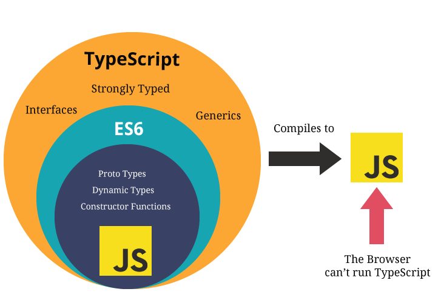

  
在  大腦升級  後   我想要學 TypeScript 了  
   與 JS & ECMAScript 
  

  

    
  

---

  
  ECMAScript 始於 JavaScript 
  

  

 
  

   
  

  

  <Arrow x1="500" y1="200" x2="700" y2="100" color="#2c2c2c" width="2.5"/>
  

   
  

  
Javascript

  

  
  

  <Arrow x1="380" y1="200" x2="130" y2="100" color="#2c2c2c" width="2.5"/>
  

   
  

  
JScript

  

  

     ECMAScript 標準化寫法 
  

  

  

---

  
 ECMAScript 
  

  
出現目的:

  

    為了解決 JavaScript 的互通性問題，一個叫做 ECMA 的組織（歐洲計算機製造商協會）開始『 標準化 』這個語言，所以誕生了 『 ECMAScript 』。
  

  
版本:

  

    有很多不同版本的 ECMAScript，其中最有影響力的是ES6 (也被稱為 ECMAScript 2015)。這個版本加入了很多新特性，如Arrow Function、ES Module、類等
  

  

---

<h3 class="font-bold my-auto  mx-auto  text-xl  text-center p-3 text-[#2e79c7]">即使 JavaScript 有了 ECMAScript 規範，還是 『 弱型別 』</h3>

  
ECMAScript

  

   
  
  

---

 
TypeScript 與 JavaScript 、 ECMAScript  ?

 

---
