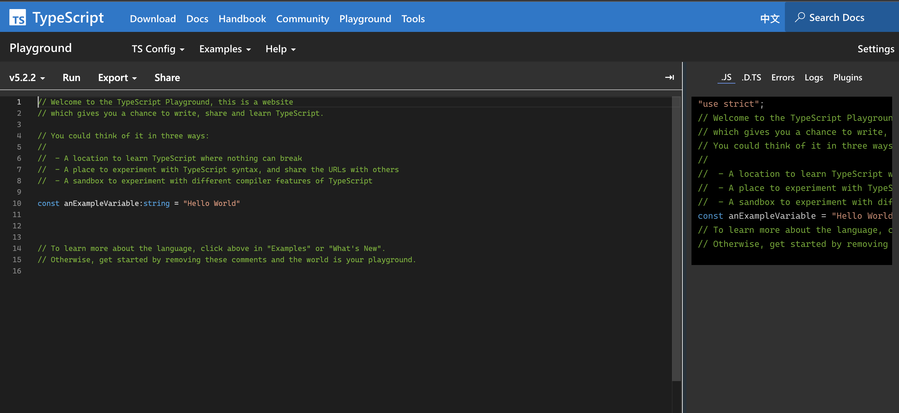
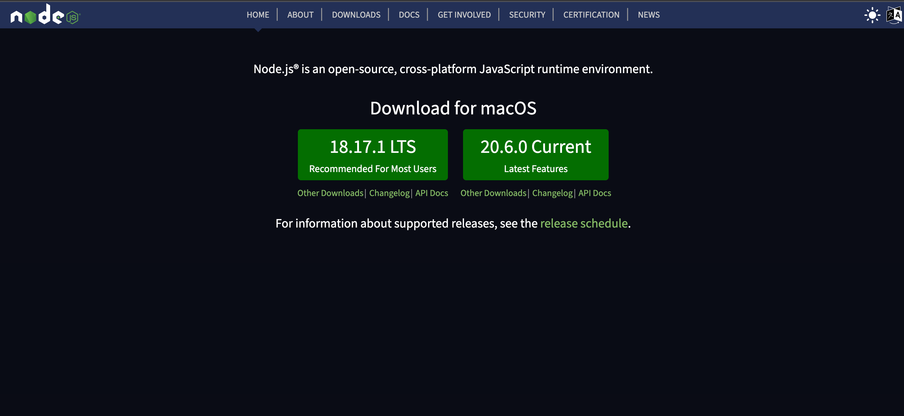

<div class="flex h-full space-x-8  mb-10 justify-center items-center">
  <div class="font-bold  text-left tracking-wide p-3 text-[#2e79c7] text-[35px] relative">在 <span class="text-center p-0.5  px-3  text-[55px] inline-block"> 大腦升級 </span> 後  <br>我想要學 TypeScript 了  
  <span class="bg-[#2e79c7] mt-8 text-white text-center p-1 text-[20px] w-60 block"> TypeScript 環境安裝</span> 
  </div>
  <div class="h-42 w-42">
    
  </div>
</div>
<div class="mx-auto bg-[#2e79c7] h-3 right-0 bottom-0 left-0 absolute"></div>

---

<div class="font-bold  text-center mb-5 tracking-wide  text-[#2e79c7] text-[30px] relative">  
線上版 TypeScript <a class="text-right"  target="_blank" href="https://www.typescriptlang.org/play?ssl=9&ssc=1&pln=1&pc=1#code/PTAEHUFMBsGMHsC2lQBd5oBYoCoE8AHSAZVgCcBLA1UABWgEM8BzM+AVwDsATAGiwoBnUENANQAd0gAjQRVSQAUCEmYKsTKGYUAbpGF4OY0BoadYKdJMoL+gzAzIoz3UNEiPOofEVKVqAHSKymAAmkYI7NCuqGqcANag8ABmIjQUXrFOKBJMggBcISGgoAC0oACCbvCwDKgU8JkY7p7ehCTkVDQS2E6gnPCxGcwmZqDSTgzxxWWVoASMFmgYkAAeRJTInN3ymj4d-jSCeNsMq-wuoPaOltigAKoASgAywhK7SbGQZIIz5VWCFzSeCrZagNYbChbHaxUDcCjJZLfSDbExIAgUdxkUBIursJzCFJtXydajBBCcQQ0MwAUVWDEQC0gADVHBQGNJ3PkqZROCMALygABEAAkYNAMOB4GRokLgsEVDhmh4yF5ENLnMD2DQvm4zMx2AxmJB+LBoOpEhz4HoRF4hXSGUzBEKktiheAHKgAOTCABykAkQqCKgA8l8yO9BCatJAjqhHApXNI8KAnOqdMMsPoUAhENDhJddRJpdERAYONiFkxWBweEESkA">Playground </a>
</div>


---

<div class="font-bold my-auto mx-auto bg-[#2e79c7] mt-44 text-center text-white p-3 text-[30px] w-100">本機端安裝 TypeScript</div>

---

<div class="font-bold  text-center mb-5 tracking-wide  text-[#2e79c7] text-[30px] relative">
建立 Node環境
</div>


<div class="mx-auto bg-[#2e79c7] h-3 right-0 bottom-0 left-0 absolute"></div>

---

<div class="font-bold  text-left my-5 tracking-wide  text-[#2e79c7] text-[20px] relative">
1. 建立一個專案
</div>

```
pnpm init

```

<div class="font-bold  text-left my-5 tracking-wide  text-[#2e79c7] text-[20px] relative">
2. 安裝 typeScript 
</div>

```
npm install typescript --save-dev

```

<div class="font-bold  text-left my-5 tracking-wide  text-[#2e79c7] text-[20px] relative">
3. 透過 tsc 編譯
</div>

```
tsc index.ts

```

<div class="mx-auto bg-[#2e79c7] h-3 right-0 bottom-0 left-0 absolute"></div>

---

<div class="mx-auto bg-[#2e79c7] h-3 right-0 bottom-0 left-0 absolute"></div>

---

<div class="font-bold my-auto mx-auto bg-[#2e79c7] mt-44 text-center text-white p-1 px-2 text-[28px] w-40">IDE 的選擇</div>

---
