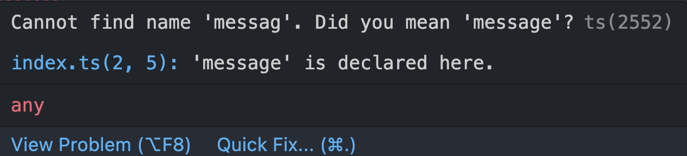

<div class="flex h-full space-x-8 items-center justify-center">
  <div class="font-bold  text-left tracking-wide p-3 text-[#2e79c7] text-[35px] relative">在 <span class="text-center p-0.5  px-3  text-[55px] inline-block"> 大腦升級 </span> 後  <br>我想要學 TypeScript 了  
  <span class="bg-[#2e79c7] mt-10 text-white text-center p-1 text-[20px] w-20 block">前言篇</span>  
  </div>
  <div class="h-42 w-42">
    
  </div>
</div>
<div class="mx-auto bg-[#2e79c7] h-3 right-0 bottom-0 left-0 absolute"></div>

---

<div class="flex h-full mx-auto h-350px mx-3  items-center justify-center relative">
  <div class="  text-right mr-5 w-215px inline-block">
    <div class="w-215px">
      
    </div>
  </div>

   <div class="font-bold mx-auto  bg-[#2F6FB0] text-center text-white px-3  top-50 left-16  text-[30px] absolute" v-click="1">
    Web Designer
   </div>
   <div class="font-bold mx-auto  text-center top-50 right-6 text-[30px]  text-[#2F6FB0]  absolute " v-click="2">
      Frontend Developer
   </div>
</div>

<div class="mx-auto bg-[#2e79c7] h-3 right-0 bottom-0 left-0 absolute"></div>

---

<h3 class="font-bold my-auto  mx-auto mt-44 text-xl  text-center p-3 text-[#2e79c7]">為什麼想以影片的方式呈現？</h3>

<div class="mx-auto bg-[#2e79c7] h-3 right-0 bottom-0 left-0 absolute"></div>

---

<div  class="font-bold  mt-10  text-xl text-center text-[#2e79c7]" >
 <div>龍哥: 『 講到你阿嬤都聽得懂的話，那你就會了 』</div>
 
</div>

<div class="mx-auto bg-[#2e79c7] h-3 right-0 bottom-0 left-0 absolute"></div>

---

<h3 class="font-bold my-auto  mx-auto mt-44 text-xl  text-center p-3 text-[#2e79c7]">為什麼選擇 TypeScript 作為這次主題？</h3>

<div class="bg-white m-auto mx-auto h-280px mt-28 top-0 right-0 bottom-0 left-0 w-120 absolute " v-click="1">
  
</div>

<div class="bg-white font-bold  m-auto text-center pt-54 top-0 right-0 bottom-0 left-0 text-28px  text-[#2e79c7]  w-200  absolute"  v-click="2">想看懂源碼 跟 開發 Plugin</div>

<div class="mx-auto bg-[#2e79c7] h-3 right-0 bottom-0 left-0 absolute"></div>

---

<div class=" space-y-4 text-[#2e79c7]">
  <div class="font-bold text-left tracking-wide  text-[#2e79c7] text-[26px] relative"> 什麼是TypeScript?
  </div>
  <div>
  為 JavaScript 的一個超集(Superset)，主要提供了『 型別系統 』和對 『 ES6 、部分 ESNext 語法 』 的擴充支援，由 Microsoft 開發。
  
  </div>
</div>

<div class="rounded-full  mx-auto    h-80   pb-6  w-80 relative ">
  <div class="rounded-full  mx-auto bg-[#2E79C7]   h-80  mt-6 pb-6  w-80 relative "  v-click='2'>
    <div class="mx-auto text-xl p-1 top-5 right-0  left-0 w-[70px] z-5 inline-block absolute">
      
    </div>  
  </div>

<div class="rounded-full  mx-auto bg-[#f0dc4e]  h-40  mt-16  pb-6  right-0 bottom-4 left-0 w-40  absolute" v-click='1'>
  <div class="mx-auto text-xl p-1 right-0 bottom-3  left-0 w-[60px] inline-block absolute">
   
  </div>  
</div>

</div>

<div class="mx-auto bg-[#2e79c7] h-3 right-0 bottom-0 left-0 absolute"></div>

---

<div class="flex  space-x-1 mb-10 items-center">
  <div class="font-bold text-left tracking-wide  text-[#2e79c7] text-[20px] relative"> 當拼錯時...
  </div>
</div>

<span class="font-bold bg-[#f0dc4e] text-black p-1 w-80">JavaScript</span>

<div class="mb-10">

```js
// index.js
let message = "Hello JavaScript";

messag = 666; // 在還沒啟index.js時 不會報錯;
```

</div>

<div class="mb-10 relative" v-click='1'>

<span class="font-bold bg-[#2e79c7] mt-20 text-white p-1 w-60">TypeScript</span>

<div class="mb-10 relative">

```ts
// index.ts
let message: string = "Hello TypeScript";

messag = 666; // 在還沒啟index.js時;
```



</div>

</div>

---

<div class="flex h-full  items-center justify-around">
  <div class="font-bold bg-[#2e79c7] h-20 text-white text-center p-2 px-10 text-[20px]"> TypeScript 好處多多<br>快樂多多? </div>
  <div class="text-left mr-4 text-[#2e79c7] text-[19px]">
    <div>1. 增加了程式碼的可讀性和可維護性</div>
    <div>2. 搭配編輯器使用，編譯階段就能檢查類型發現大部分錯誤</div>
    <div>3. 支持 ES6 規範 </div>
  </div>
</div>
<div class="mx-auto bg-[#2e79c7] h-3 right-0 bottom-0 left-0 absolute"></div>

---

<div class="font-bold my-auto mx-auto bg-[#2e79c7] mt-40 text-center text-white p-3 text-2xl w-80">所以一定要用 TypeScript ? </div>

---

<div class="h-full ">
  <div class="font-bold my-auto  mx-auto text-center p-3 text-[#2e79c7] text-3xl">當時身為新手的我無感... </div>
  <div class="flex h-46 mt-24 w-full items-center  justify-center relative">
    <div class="rounded-full mx-auto bg-[#CEDCEC66] h-60  text-center top-2 right-70 left-0 w-60 -z-3 absolute" ></div>
    <div class="rounded-full mx-auto bg-[#CAD8E64D] h-48 text-center right-0 -bottom-3 left-0 w-48  -z-1 absolute" ></div>
    <div class="rounded-full mx-auto bg-[#C4E1FF33] h-68 text-center top-3 right-0 left-90 w-68 -z-2 absolute " ></div>
    <div class="font-bold mx-auto  text-center top-0 left-50 text-30px text-[#2F6FB0]  leading-60  w-40 absolute " >
      團隊的使用 
    </div>
    <div class="font-bold m-auto text-center top-0  right-0 bottom-0 left-0 text-30px text-[#2F6FB0] leading-48  w-40 absolute ">
      JSDoc
    </div>
    <div class="font-bold text-center right-14 right-34 bottom-0 bottom-5   text-30px  text-[#2F6FB0]  w-60   absolute">
      權衡學習成本
    </div>
  </div>
</div>

<div class="mx-auto bg-[#2e79c7] h-3 right-0 bottom-0 left-0 absolute"></div>

---

<div class="font-bold my-auto  mx-auto text-center p-3 text-[#2e79c7] text-3xl">建議讀者觀看接下來影片需要先知道的事</div>

<div class="flex font-bold space-x-10 mt-18 text-[#2e79c7] justify-center">
<div class="border-dashed rounded-full border-[#2e79c7] border-3 text-center   py-20.5 w-50">
  JavaScript <br> 基礎觀念 
</div>
<div class="border-dashed rounded-full border-[#2e79c7]  border-3 text-center   py-20.5 w-50">
  ECMAScript <br>(ES5、ES6~)
</div>

</div>

<div class="mx-auto bg-[#2e79c7] h-3 right-0 bottom-0 left-0 absolute"></div>

---

<div class="font-bold my-auto  mx-auto text-center p-3 text-[#2e79c7] text-3xl">預計有的內容</div>

<ul class="mt-10 text-xl text-[#2e79c7]">
  <li>TypeScript 簡介</li>
  <li>TypeScript 環境設置與安裝 </li>
  <li>TypeScript 基本型別 </li>
  <li>TypeScript 進階 篇</li>
  <li>TypeScript & ECMAScript 應用篇</li>
  <li>TypeScript & Vite 篇</li>
  <li>TypeScript & Vue 篇</li>
</ul>

<div class="mx-auto bg-[#2e79c7] h-3 right-0 bottom-0 left-0 absolute"></div>

---

<div class="font-bold   mx-auto mt-40 text-center p-3 text-[#2e79c7] text-3xl">總結以上 </div>

<div class="mx-auto bg-[#2e79c7] h-3 right-0 bottom-0 left-0 absolute"></div>

---

<div class="font-bold   mx-auto mt-40 text-center p-3 text-[#2e79c7] text-3xl"><span class="bg-[#2e79c7] mt-8 text-white text-center p-1 text-[20px] w-60 inline-block"> 下集預告: <br/>與 JS & ECMAScript</span> </div>

<div class="mx-auto bg-[#2e79c7] h-3 right-0 bottom-0 left-0 absolute"></div>
