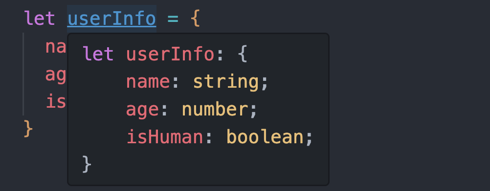
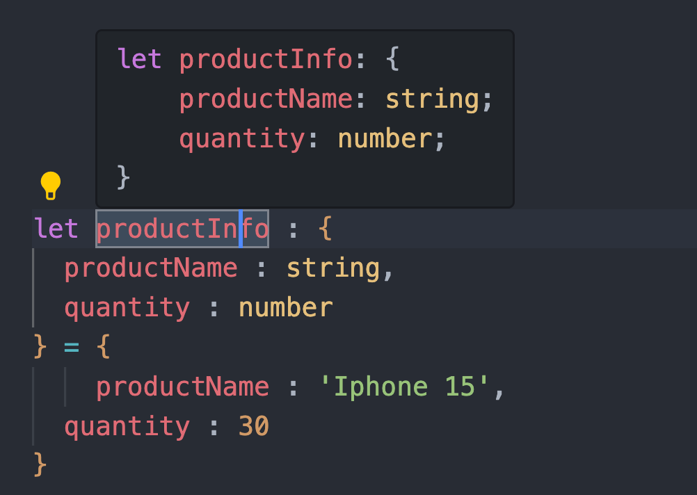
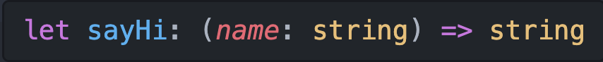
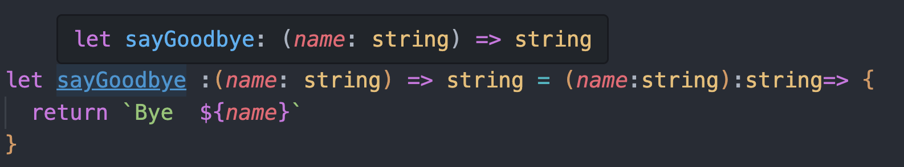

<style>
</style>

<div class="flex h-full space-x-8  mb-10 justify-center items-center">
  <div class="font-bold  text-left tracking-wide p-3 text-[#2e79c7] text-[35px] relative">在 <span class="text-center p-0.5  px-3  text-[55px] inline-block"> 大腦升級 </span> 後  <br>我想要學 TypeScript 了  
  <span class="bg-[#2e79c7] mt-8 text-white text-center p-1 text-[20px] w-70 block">明文型別 Literal Type</span> 
  </div>
  <div class="h-42 w-42">
    
  </div>
</div>
<div class="mx-auto bg-[#2e79c7] h-3 right-0 bottom-0 left-0 absolute"></div>

---

<div class="rounded-full m-auto bg-[#CEDCEC66] h-64  text-center  top-0 right-0  bottom-0 left-0 w-64 -z-3 absolute " ></div>
<div class="font-bold mx-auto  mt-50  text-center text-24px  text-[#2F6FB0] " >
  TypeScript <br>型別類型
  
</div>

<div class="  border-dashed rounded-md font-bold  border-[#2F6FB0] border-2 text-center  opacity-25 py-1.5 px-6 top-28 left-40 text-[#2F6FB0] w-50 absolute" >
  原始資料型別 (Primitive Type)  
  
</div>
<div class="  border-dashed   rounded-sm font-bold border-[#2F6FB0] border-2 text-center  opacity-25  py-1.5 px-4 top-58 left-30 text-[#2F6FB0] w-48 absolute" >
  物件型別 <br>(Object Type)
  
</div>
<div class="  bg-white border-dashed  rounded-md  font-bold  border-[#2F6FB0e6]  border-2 shadow-inner  text-center  opacity-25 py-1.5 px-4 top-90 left-34 text-[16px] text-[#2F6FB0] w-55 absolute">
  TypeScript 擴充型別 (Tuple、Enum)
</div>
<div class="rounded-md font-bold bg-[#2F6FB0]   shadow-inner text-center  text-white py-2 px-4 top-20  right-32 text-[16px] w-60 absolute" >
  明文型別<br> (Literal Type)
</div>
<div class="bg-white border-dashed rounded-md font-bold border-[#2F6FB0e6] border-2 shadow-inner text-center  opacity-25 py-1.5 px-4 top-46 right-18 text-[16px] text-[#2F6FB0] w-62 absolute" >
  特殊型別 <br>(any、unknown、never) 
</div>
<div class="bg-white border-dashed rounded-md font-bold border-[#2F6FB0e6] border-2 shadow-inner text-center opacity-25 py-1.5 px-4 right-18 bottom-50 text-[16px] text-[#2F6FB0] w-64 absolute" >
  複合型別 <br>(union、intersection)
</div>

<div class="bg-white border-dashed rounded-md font-bold border-[#2F6FB0e6] border-2 shadow-inner text-center opacity-25 py-1.5 px-4 right-26 bottom-22 text-[16px] text-[#2F6FB0] w-64 absolute">
  通用型別 <br>(Generics)
</div>

<div class="mx-auto bg-[#2e79c7] h-3 right-0 bottom-0 left-0 absolute"></div>

---

<div class="font-bold my-auto  mx-auto text-left  text-[#2e79c7] text-3xl">
明文型別 Literal Type
</div>

<div class="mt-5 text-[#696969]">
明文型別 是指將變數限定為某一項具體的值，而這個值也可以是一個變數的型別。
</div>

<div class="my-5">
 <div class="font-medium  mb-5  py-0.5 text-[#696969] text-[18px]">以 原始資料型別 為例 :</div>

```javascript{all|1|2|3}
const userName = "winnie"; // type -> winnie
const winnieAge = 18; // type -> 18
const isHuman = false; // type -> false
```

</div>

<div class="my-5">
 <div class="font-medium  mb-5  py-0.5 text-[#696969] text-[18px]">使用 型別化名 Type Alias :</div>

<!-- 型別化名通常會用在明文型別、複合型別（union 與 intersection）以及比較複雜的型別格式名稱必須作抽象化（Abstraction）等等 -->

```javascript
 type Size = 'small' | 'medium' | 'large';

 let shirtSize: Size = "small";  // X
 shirtSize = "extra-large"; // O

```

</div>

<div class="mx-auto bg-[#2e79c7] h-3 right-0 bottom-0 left-0 absolute"></div>

---

<div class="font-bold my-auto  mx-auto text-left  text-[#2e79c7] text-[26px]">物件明文型別 (Object literal Type) </div>

<div class="my-5 text-[#696969]">
物件明文型別 是 明確地將物件中『型別格式』提示出來
</div>

<div class="text-2xl relative ">

```javascript
let userInfo = {
  name: "winnie",
  age: 26,
  isHuman: false,
};
```

<div class="my-5 text-[#696969] text-16px">
假使以 『物件的明文型別的格式』來進行註解
</div>

```javascript

// 但注意這邊只是模擬示範，不建議這樣使用

let productInfo : {
  productName : string,
  quantity : number
} = {
    productName : 'Iphone 15',
  quantity : 30
}
```



</div>

---

<div class="font-bold my-auto  mx-auto text-left  text-[#2e79c7] text-[26px]">函式明文型別 </div>

<div class="mt-10 text-2xl relative">

```javascript
let sayHi = (name: string, age: number)=> {
 return `Hi I am ${name}`
}
```

<div class="my-5 text-[#696969] text-16px">
假使以 『函式的明文型別的格式』來進行註解
</div>

```javascript

// 但注意這邊只是模擬示範，不建議這樣使用

let sayGoodbye :(name: string) => string = (name:string):string=> {
  return `Bye ${name}!!`
}

```



</div>

---

 <div class="font-bold my-auto  mx-auto mt-5 text-center  text-[30px] text-[#2e79c7]">當 型別註解 一多...</div>


<div class="mx-auto bg-[#2e79c7] h-3 right-0 bottom-0 left-0 absolute"></div>

---

<div class="font-bold   mx-auto mt-30 text-center  text-[#2e79c7] text-3xl"><span class="text-center   p-1 text-[#2e79c7] text-[26px] w-80 inline-block"> 型別化名(Type Alias)</span> </div>
<div class="my-5 text-center text-[#696969] text-18px">
 通常用在『明文型別』、『複合型別（union 與 intersection）』 及『較複雜的型別格式』<span class="mt-1.5 text-20px block">以 『 type關鍵字 + 名稱 』做 抽象化</span>
</div>

<div class="mx-auto bg-[#2e79c7] h-3 right-0 bottom-0 left-0 absolute"></div>

---

<div class="font-bold   mx-auto mt-40 text-center p-3 text-[#2e79c7] text-3xl"><span class="bg-[#2e79c7] mt-8 text-white text-center p-1 text-[20px] w-80 inline-block"> 實際 DEMO
</span> </div>

<div class="mx-auto bg-[#2e79c7] h-3 right-0 bottom-0 left-0 absolute"></div>

---

<div class="font-bold   mx-auto mt-40 text-center p-3 text-[#2e79c7] text-3xl"><span class="bg-[#2e79c7] mt-8 text-white text-center p-1 text-[20px] w-80 inline-block"> 『物件的明文型別』作為 函式參數<br>需要注意的地方
</span> </div>

<div class="mx-auto bg-[#2e79c7] h-3 right-0 bottom-0 left-0 absolute"></div>

---

<div class="font-bold my-auto  mx-auto text-center p-3 text-[#2e79c7] text-3xl">今日總結</div>

<div class="h-full ">
  <div class="flex h-46 mt-14 w-full items-center  justify-center relative">
    <div class="rounded-full mx-auto bg-[#CEDCEC66] h-70  text-center top-2 right-70 left-0 w-70 -z-3 absolute" ></div>
    <div class="rounded-full mx-auto bg-[#CAD8E64D] h-48 text-center right-0 -bottom-3 left-0 w-48  -z-1 absolute" ></div>
    <div class="rounded-full mx-auto bg-[#C4E1FF33] h-68 text-center top-3 right-0 left-90 w-68 -z-2 absolute " ></div>
    <div class="font-bold mx-auto  text-center top-32 left-44 text-30px text-[#2F6FB0]    w-60 absolute " >
      明文型別 
    </div>
    <div class="font-bold m-auto left- text-center  top-20 right-0 bottom-0 left-0 text-24px text-[#2F6FB0]  w-55 absolute ">
      型別化名 
    </div>
    <div class="font-bold text-center right-14 right-34 bottom-0    text-24px  text-[#2F6FB0]  w-60   absolute">
      物件作為函式參數<br>需注意
    </div>
  </div>
</div>

<div class="mx-auto bg-[#2e79c7] h-3 right-0 bottom-0 left-0 absolute"></div>

---

<div class="font-bold   mx-auto mt-40 text-center p-3 text-[#2e79c7] text-3xl"><span class="bg-[#2e79c7] mt-8 text-white text-center p-1 text-[20px] w-80 inline-block"> 下集預告: <br/>選用屬性
</span> </div>

<div class="mx-auto bg-[#2e79c7] h-3 right-0 bottom-0 left-0 absolute"></div>
