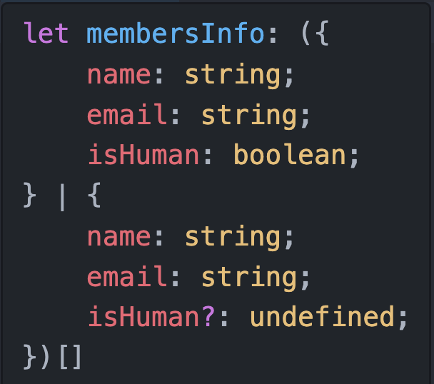
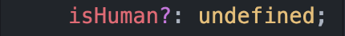

<style>
</style>

<div class="flex h-full space-x-8  mb-10 justify-center items-center">
  <div class="font-bold  text-left tracking-wide p-3 text-[#2e79c7] text-[35px] relative">在 <span class="text-center p-0.5  px-3  text-[55px] inline-block"> 大腦升級 </span> 後  <br>我想要學 TypeScript 了  
  <span class="bg-[#2e79c7] mt-8 text-white text-center p-1 text-[20px] w-80 block">選用屬性 Optional Properties</span> 
  </div>
  <div class="h-42 w-42">
    
  </div>
</div>
<div class="mx-auto bg-[#2e79c7] h-3 right-0 bottom-0 left-0 absolute"></div>

---

<div class="font-bold   mx-auto mt-40 text-center p-3 text-[#2e79c7] text-3xl"><span class="bg-[#2e79c7] mt-8 text-white text-center p-1 text-[23px] w-80 inline-block"> 選用屬性是什麼
</span></div>

<div class="mx-auto bg-[#2e79c7] h-3 right-0 bottom-0 left-0 absolute"></div>

---

<div class="flex  font-bold mt-40 text-center p-3 text-3xl text-[#2e79c7]  items-center justify-center "><span class="bg-[#2e79c7] text-white ml-10 p-3 inline-block">  可以有，也可以沒有</span><span class="ml-10 inline-block" > = </span>

<span class="text-center  ml-10 p-1 text-[#2e79c7]  text-7xl inline-block"> ?
</span>

</div>

<div class="mx-auto bg-[#2e79c7] h-3 right-0 bottom-0 left-0 absolute"></div>

---

<div class="my-5 text-[#696969] text-20px ">
『 選用屬性 』出現的地方
</div>
<div class="">
 
```javascript

let membersInfo = [
{
name: 'winnie',
email: 'winnin@xx.com',
isHuman: false
},
{
name: 'jack',
email: 'jack@xx.com',
}
]

````


</div>

<div  class="border-[#CE0000] border-2 top-68  left-69 scale-115  absolute" v-click="2">
  
</div>

<Arrow x1='550' x2="630" y1="286" y2="286"  color="#be3333" class="transition" v-if="$slidev.nav.clicks === 2"/>

<div class=" bg-white  border-[#FCFCFC]  font-medium border-0.5 shadow-md px-2   transition top-67 right-38 text-[18px] text-[#696969] absolute   inner-shadow" v-if="$slidev.nav.clicks === 2">
屬性 + <span class="text-22px text-[#AE0000cc] ">?</span> : undefined
</div>


<div class="mx-auto bg-[#2e79c7] h-3 right-0 bottom-0 left-0 absolute"></div>

---

<div class="font-bold my-auto  mx-auto text-left p-3 text-[#2e79c7] text-2xl">為什麼要使用 選用屬性？</div>

<div >

```javascript {all|12-20|4-10|2|all}

enum Gender { Male, Female, Other }

type MembersInfoType = {
  account: string,
  password : string,
  nickname: string,
  email: string,
  phoneNumber: string
  gender: Gender
}

let memberInfo: MembersInfoType = {
  account: "winnieAccount",
  password: "123456789",
  nickname: "winnie", // 非必填
  email: "winnie@xx.com",
  phoneNumber: '0900000000',
  gender: 1
};

````

</div>

<div class="mx-auto bg-[#2e79c7] h-3 right-0 bottom-0 left-0 absolute"></div>

---

<div class="font-bold  mx-auto border-b-3 border-[#2e79c7] mt-30 text-center pb-3 text-[#2e79c7] text-4xl w-60"><span class="mt-8 text-center  text-[#2e79c7] text-[30px] w-60 inline-block"> 程式範例 DEMO </span></div>

<div  class="font-medium mx-auto mt-3 text-center text-xl tracking-wide p-2 text-[#2e79c7] w-60">
 - 以 『會員資料』 為例 -
</div>

<div class="mx-auto bg-[#2e79c7] h-3 right-0 bottom-0 left-0 absolute"></div>

---

<div class="font-bold  mx-auto mt-35 text-center p-3 text-[#2e79c7] text-3xl"><span class="bg-[#2e79c7] mt-8 text-white text-center p-1 text-[20px] w-50 inline-block"> 總結以上
</span> </div>

<div class="mx-auto bg-[#2e79c7] h-3 right-0 bottom-0 left-0 absolute"></div>

---

<div class="font-bold   mx-auto mt-30 text-center p-3 text-[#2e79c7] text-3xl"><span class="bg-[#2e79c7] mt-8 text-white text-center p-1 text-[20px] w-80 inline-block"> 下集預告: <br/>特殊型別 never
</span> </div>

<div class="mx-auto bg-[#2e79c7] h-3 right-0 bottom-0 left-0 absolute"></div>
