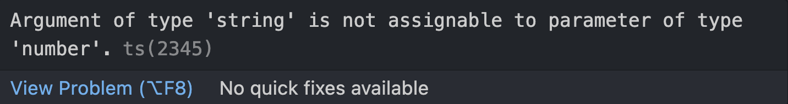

<div class="flex h-full space-x-8  mb-14 justify-center items-center">
  <div class="font-bold  text-left tracking-wide p-3 text-[#2e79c7] text-[35px] relative">在 <span class="text-center p-0.5  px-3  text-[55px] inline-block"> 大腦升級 </span> 後  <br>我想要學 TypeScript 了  
  <span class="bg-[#2e79c7] mt-8 text-white text-center p-1 text-[20px] w-60 block"> 與 JS & ECMAScript</span> 
  </div>
  <div class="h-42 w-42">
    
  </div>
</div>
<div class="mx-auto bg-[#2e79c7] h-3 right-0 bottom-0 left-0 absolute"></div>

---

<div class="font-bold my-auto mx-auto  text-center p-3 text-[#2e79c7] text-3xl leading-12">今日的內容</div>

<ul class="mt-10 text-xl text-[#2e79c7]">
  <li>關於 ECMAScript </li>
  <li>JavaScript 與 ECMAScript 的 故事 </li>
  <li>JavaScript 、 ECMAScript 與 TypeScript 的關係</li>
</ul>

---

<div class="font-bold my-auto mx-auto  text-center p-3 text-[#2e79c7] text-3xl leading-12">TypeScript 是 JavaScript 的超集(Superset)<br><span>同時也支持與 ECMAScript 的協作</span></div>

<div class="rounded-full  mx-auto bg-[#2E79C7]   h-80  mt-10  pb-6  w-80 relative " >
  <div class="mx-auto text-xl p-1 top-5 right-0  left-0 w-[70px] z-5 inline-block absolute" >
   
  </div>  
<div class="rounded-full  mx-auto bg-[#f0f0f0]   h-48  mt-16  pb-6  right-0 bottom-4 left-0 w-48  absolute" >
  <div class="font-bold mx-auto h-10  text-center top-14 right-0  left-0 text-[20px]  text-[#696969] absolute" >ECMAScript (ES6)</div> 
</div>

<div class="mx-auto text-xl p-1 right-0 bottom-5  left-0 w-[70px] inline-block absolute" >
  
</div>

</div>

---

  <div class="font-bold  text-left mb-5 tracking-wide  text-[#2e79c7] text-[30px] relative"> ECMAScript
  </div>
  <div class="mt-5  text-[#3C3C3C]">
    為了解決 JavaScript 的互通性問題，一個叫做 ECMA 的組織（歐洲計算機製造商協會）開始『 標準化 』這個語言，所以誕生了 『 ECMAScript 』。
  </div>

  <div class=" mx-auto h-80 w-full relative">
      <div class="bg-white mx-auto text-xl p-1 right-0 bottom-5 left-0 w-[130px] z-10 absolute ">
   
  </div>
  <div>
  <Arrow x1="400" y1="250" x2="720" y2="150" color="#2c2c2c" width="2.5"/>
  <div class=" bg-white rounded-full border-4 h-[120px] shadow text-xl  p-1  top-25 right-18 w-[120px] absolute">
   
  </div>

  <div >
  <Arrow x1="380" y1="250" x2="130" y2="100" color="#2c2c2c" width="2.5"/>
  <div class=" bg-white rounded-full border-4 h-[140px] shadow text-xl p-1 top-20  left-18  w-[140px]  absolute" >
   
  </div>
  <div class="font-bold mx-auto bg-[#2e79c7] text-white text-shadow text-center text-xl  py-1  top-50 left-21 w-30 absolute">JScript</div>
  </div>
  <div class="font-bold mx-auto bg-[#2e79c7] text-white text-shadow text-center py-1  top-50 right-18 text-[16px] w-30 absolute">Javascript</div>
  </div>
    <div class=" h-full bg-[#f1f1f180]  mt-5 w-full" >
    <span class="font-bold right-4 bottom-4 text-[#000000CC] block absolute"> ECMAScript 標準化寫法 </span>
  </div>
  </div>

  <div class="mx-auto bg-[#2e79c7] h-3 right-0 bottom-0 left-0 absolute"></div>

---

  <div class="font-bold  text-center mb-10 tracking-wide  text-[#2e79c7] text-[28px] relative">  ECMAScript 版本
  </div>

  <div class="  space-x-30 h-300px  w-auto pt-10  relative "><div class="font-bold m-auto bg-[#f0dc4e] h-20 text-center py-6 top-0 bottom-0 left-10 w-40 inline-block absolute ">ES1 ~ ES3</div>
  <div class="font-bold m-auto bg-[#f0dc4e] h-20 text-center opacity-50 py-6 top-0 bottom-0  left-48 text-[#b0b0b0] w-20 inline-block absolute">ES4</div>
  <div class="font-bold m-auto bg-[#f0dc4e] h-20 text-center py-6 top-0 bottom-0 left-74 w-20 inline-block absolute">ES5</div>
  <div class="font-bold m-auto bg-[#f0dc4e] h-20 text-center py-6 top-0 right-50 bottom-0  w-30 inline-block absolute">ES6</div>
  <div class="font-bold m-auto bg-[#f0dc4e] h-20 text-center py-6 top-0 right-5 bottom-0  w-40 inline-block absolute">ES Next</div>
  </div>

  <div class="border-t-2 border-[#2e79c7] relative">
    <div class="rounded-full bg-[#2e79c7] h-3 -top-2 left-24 w-3 absolute">
    <span class="-top-10 -left-10 text-[#2e79c7] absolute">1996~1999</span>
    </div>
    <div class="rounded-full bg-[#2e79c7] h-3 -top-2 left-87 w-3 absolute">
    <span class="-top-10 -left-3 text-[#2e79c7] absolute">2008</span>
    </div>
    <div class="rounded-full bg-[#2e79c7] h-3 -top-2 left-114 w-3 absolute">
    <span class="-top-10 -left-3 text-[#2e79c7] absolute">2009</span>
    </div>
    <div class="rounded-full bg-[#2e79c7] h-3 -top-2 right-64 w-3 absolute">
    <span class="-top-10 -left-3 text-[#2e79c7] absolute">2015</span>
    </div>
    <div class="rounded-full bg-[#2e79c7] h-3 -top-2 right-20 w-3 absolute">
    <span class="-top-10 -left-3 text-[#2e79c7] absolute">2016</span>
    </div>
  </div>

---

<div  class="font-bold  text-center mb-10 text-3xl text-[#2e79c7]" >
  <div>TypeScript 與 JavaScript 、 ECMAScript ?</div> 
</div>

<div class="rounded-full  mx-auto bg-[#F0F0F0]  h-46  mt-40  pb-6  w-46 relative ">
  <div class="rounded-full  mx-auto bg-[#2e79c7]  h-80  mt-16  pb-6  right-16 bottom-29 w-80 -z-1 relative" >
  <div class="font-bold my-auto mx-auto h-10 text-left  text-white top-5  right-0  left-0 text-[22px] w-30 block absolute" >TypeScript</div>

  <div class="my-auto space-x-2 h-15  text-white top-16 right-0 text-[14px] w-70 absolute ">
    <div class="inline-block">Type Syetem、</div>
    <div class="inline-block">Enums、</div>
    <div class="inline-block">Generics、</div>
    <div class="inline-block">Interfaces、</div>
    <div class="inline-block"> Strictness levels</div>
  </div>
  
  </div>

  <div class="font-bold my-auto mx-auto h-10 text-center  top-10 right-0  left-0  text-[26px] text-[#696969] w-30 block absolute" >ES6</div>

  <div class="mx-auto text-xl p-1 right-0 bottom-3  left-0 w-[80px] inline-block absolute">
   
  </div>  
</div>
<div>
<!-- <Arrow x1='650' y1="300" x2='860' y2='300' /> -->
<!-- <div class="mx-auto text-xl p-1 right-20 bottom-54   w-[80px] inline-block absolute">
  
</div> -->
</div>
<div class="mx-auto bg-[#2e79c7] h-3 right-0 bottom-0 left-0 absolute"></div>
 
---

<div class="font-bold   mx-auto mt-40 text-center p-3 text-[#2e79c7] text-3xl"><span class="bg-[#2e79c7] mt-8 text-white text-center p-1 text-[20px] w-70 inline-block"> 下集預告:<br/>TypeScript 環境安裝與設定</span></div>

<div class="mx-auto bg-[#2e79c7] h-3 right-0 bottom-0 left-0 absolute"></div>

---

<div class="  space-x-1 mb-5 items-center">
  <div class="font-bold text-left tracking-wide  text-[#2e79c7] text-[20px] relative"> 當傳入一個 『字串的數字』 到 function 裡時...
  </div>

<span class="font-bold bg-[#f0dc4e] text-black p-1 w-80">JavaScript</span>

```js
// index.js

let num1 = 12;
let num2 = "3";

const sum = (a, b) => {
  return a + b;
};

console.log(sum(num1, num2)); // '123'
```

</div>

<div class="mb-10 relative" v-click="1">
<span class="font-bold bg-[#2e79c7] mt-20 text-white p-1 w-60">TypeScript</span>

```ts
// index.ts

const sum = (a: number, b: number) => {
  return a + b;
};

sum(12, "3"); //
```



</div>
