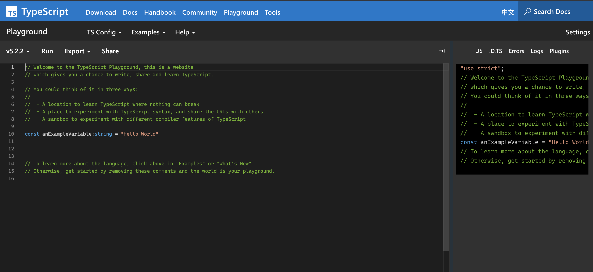
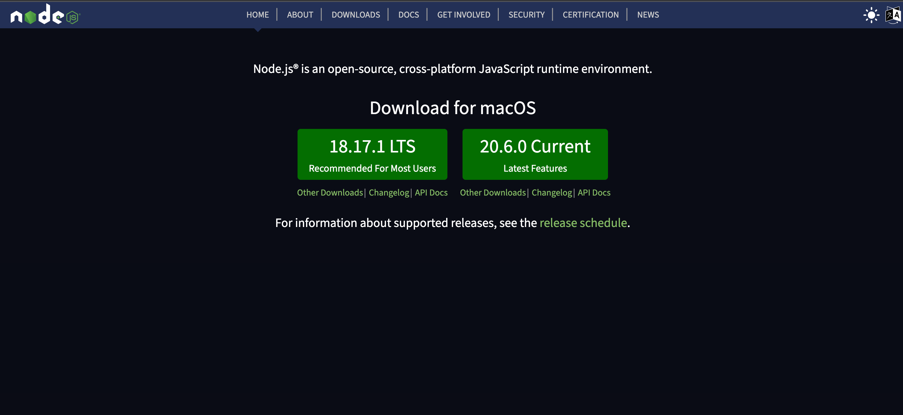

<div class="flex h-full space-x-8  mb-10 justify-center items-center">
  <div class="font-bold  text-left tracking-wide p-3 text-[#2e79c7] text-[35px] relative">在 <span class="text-center p-0.5  px-3  text-[55px] inline-block"> 大腦升級 </span> 後  <br>我想要學 TypeScript 了  
  <span class="bg-[#2e79c7] mt-8 text-white text-center p-1 text-[20px] w-60 block"> TypeScript 環境安裝</span> 
  </div>
  <div class="h-42 w-42">
    
  </div>
</div>
<div class="mx-auto bg-[#2e79c7] h-3 right-0 bottom-0 left-0 absolute"></div>

---

<div class="font-bold my-auto mx-auto  text-center p-3 text-[#2e79c7] text-3xl leading-12">今日的內容</div>

<ul class="mt-10 text-xl text-[#2e79c7]">
  <li> 線上版 TypeScript  </li>
  <li> 本機端安裝 TypeScript </li>
  <li> 關於 IDE 的選擇</li>
  <li> Hello TypeScript </li>
  <li> 關於 TSC 編譯</li>
</ul>

---

<div class="font-bold  text-center mb-5 tracking-wide  text-[#2e79c7] text-[30px] relative">  
線上版 TypeScript <a class="text-right"  target="_blank" href="https://www.typescriptlang.org/play?ssl=9&ssc=1&pln=1&pc=1#code/PTAEHUFMBsGMHsC2lQBd5oBYoCoE8AHSAZVgCcBLA1UABWgEM8BzM+AVwDsATAGiwoBnUENANQAd0gAjQRVSQAUCEmYKsTKGYUAbpGF4OY0BoadYKdJMoL+gzAzIoz3UNEiPOofEVKVqAHSKymAAmkYI7NCuqGqcANag8ABmIjQUXrFOKBJMggBcISGgoAC0oACCbvCwDKgU8JkY7p7ehCTkVDQS2E6gnPCxGcwmZqDSTgzxxWWVoASMFmgYkAAeRJTInN3ymj4d-jSCeNsMq-wuoPaOltigAKoASgAywhK7SbGQZIIz5VWCFzSeCrZagNYbChbHaxUDcCjJZLfSDbExIAgUdxkUBIursJzCFJtXydajBBCcQQ0MwAUVWDEQC0gADVHBQGNJ3PkqZROCMALygABEAAkYNAMOB4GRokLgsEVDhmh4yF5ENLnMD2DQvm4zMx2AxmJB+LBoOpEhz4HoRF4hXSGUzBEKktiheAHKgAOTCABykAkQqCKgA8l8yO9BCatJAjqhHApXNI8KAnOqdMMsPoUAhENDhJddRJpdERAYONiFkxWBweEESkA">Playground </a>
</div>


---

<div class="font-bold my-auto mx-auto bg-[#2e79c7] mt-44 text-center text-white p-3 text-[26px] w-100">本機端安裝 TypeScript</div>

---

<div class="font-bold  text-center mb-5 tracking-wide  text-[#2e79c7] text-[30px] relative">
建立 Node環境
</div>


<div class="mx-auto bg-[#2e79c7] h-3 right-0 bottom-0 left-0 absolute"></div>

---

<div class=" space-y-4 text-[#2e79c7]">
  <div class="font-bold text-left mb-10  tracking-wide text-[#2e79c7] text-[28px] relative"> IDE 的選擇 Vscode? 
  </div>
  <div class="space-y-5 mt-20">
  <div >
   1. VScode 內建支援
  </div>
  <div>
   2. IntelliSense
  </div>

  <div>
   3. 內建的 TypeScript 編譯器支援
  </div>

  <div> 4. 即時錯誤和警告</div>
  </div>
  
</div>

<div class="text-right">

</div>

<div class="mx-auto bg-[#2e79c7] h-3 right-0 bottom-0 left-0 absolute"></div>

---

<div class="font-bold  text-center mb-5 tracking-wide  text-[#2e79c7] text-[30px] relative">
安裝TypeScript
</div>

<div class="font-bold  my-5 text-left tracking-wide  text-[#2e79c7] text-[20px] relative">
1. 建立一個專案
</div>

```
pnpm init

```

<div class="font-bold  my-5 text-left tracking-wide  text-[#2e79c7] text-[20px] relative">
2. 安裝 typeScript 
</div>

```
npm install typescript --save-dev

```

<div class="font-bold  my-5 text-left tracking-wide  text-[#2e79c7] text-[20px] relative">
3. 建立 .ts 檔案
</div>

```
touch index.ts

```

<div class="mx-auto bg-[#2e79c7] h-3 right-0 bottom-0 left-0 absolute"></div>

---

<div class="font-bold   mx-auto mt-40 text-center p-3 text-[#2e79c7] text-3xl"><span class="bg-[#2e79c7] mt-8 text-white text-center p-1 text-[20px] w-60 inline-block"> Hello TypeScript</span></div>

<div class="mx-auto bg-[#2e79c7] h-3 right-0 bottom-0 left-0 absolute"></div>

---

<div class="font-bold  text-center mb-5 tracking-wide  text-[#2e79c7] text-[30px] relative">
關於 TSC 編譯器 
</div>

<div class="font-bold  my-5 text-left tracking-wide  text-[#2e79c7] text-[20px] relative">
1.將檔案 編譯成 .js
</div>

```
tsc index.ts

```

<div class="font-bold  my-5 text-left tracking-wide  text-[#2e79c7] text-[20px] relative">
2. 開啟 自動編譯 模式
</div>

```
tsc -w 或 tsc --watch

```

<div class="mx-auto bg-[#2e79c7] h-3 right-0 bottom-0 left-0 absolute"></div>

---

<div class="font-bold my-auto mx-auto text-center  p-3  text-[#2e79c7] text-[26px] w-100">使用 ts-node 直接執行 TS 檔</div>

<div class="font-bold  my-5 text-left tracking-wide  text-[#2e79c7] text-[20px] relative">
1. 安裝 ts-node 到專案資料夾中
</div>

```
$ pnpm install -g ts-node
```

<div class="font-bold  my-5 text-left tracking-wide  text-[#2e79c7] text-[20px] relative">
2. 使用 ts-node 執行某支 TS
</div>

```
$ ts-node index.ts

```

<div class="mx-auto bg-[#2e79c7] h-3 right-0 bottom-0 left-0 absolute"></div>

---

<div class="font-bold   mx-auto mt-40 text-center p-3 text-[#2e79c7] text-3xl"><span class="bg-[#2e79c7] mt-8 text-white text-center p-1 text-[20px] w-100 inline-block"> 為什麼 編譯出來的 JavaScript 有提示 ? </span></div>

<div class="mx-auto bg-[#2e79c7] h-3 right-0 bottom-0 left-0 absolute"></div>

---

<div class="font-bold  text-center  tracking-wide  text-[#2e79c7] text-[28px] relative">
<div class="border-t top-56 left-28 w-50 -z-2 -rotate-20 absolute"></div>
<div class="border-t top-74 left-26 w-26 -z-2 rotate-25 absolute"></div>
為什麼 <span class="bg-[#ECF5FF] mx-1 text-center px-2  inline-block">tsc index.ts </span>編譯出來會是 var ? 
</div>

<div class="flex space-x-20 h-300px mt-16 px-10 items-center">
<div class="bg-[#f1f1f1] h-20  text-center py-6 w-20">index.ts</div>
<div class="space-y-10">

<div class="h-auto space-x-30 text-center w-auto relative">
  <div class="bg-[#f1f1f1] h-20 text-center  py-6 w-40 inline-block">tsc index.ts</div>
  <div class="border-t top-10 w-80 -z-2  absolute"></div>
  <div class="bg-[#f1f1f1] h-20 text-center py-6 w-20 inline-block">index.js</div>
</div>
<div class="h-auto space-x-30 text-center w-auto relative">
  <div class="bg-[#f1f1f1] h-20 text-center py-6 w-20 inline-block">tsc</div>
  <div class="border-t top-10 -left-15 w-110 -z-2 absolute"></div>
  <div class="bg-[#f1f1f1] h-20 text-center  py-6 w-40 inline-block">tsconfig.json</div>
  <div class="bg-[#f1f1f1] h-20 text-center py-6 w-20 inline-block">index.js</div>
</div>
</div>
</div>

<div class="mx-auto bg-[#2e79c7] h-3 right-0 bottom-0 left-0 absolute"></div>

---

<div class="font-bold   mx-auto mt-40 text-center p-3 text-[#2e79c7] text-3xl">總結以上 </div>

<div class="mx-auto bg-[#2e79c7] h-3 right-0 bottom-0 left-0 absolute"></div>

---

<div class="font-bold   mx-auto mt-40 text-center p-3 text-[#2e79c7] text-3xl"><span class="bg-[#2e79c7] mt-8 text-white text-center p-1 text-[20px] w-70 inline-block"> 下集預告:<br/>TypeScript Config 基本設定</span></div>

<div class="mx-auto bg-[#2e79c7] h-3 right-0 bottom-0 left-0 absolute"></div>
